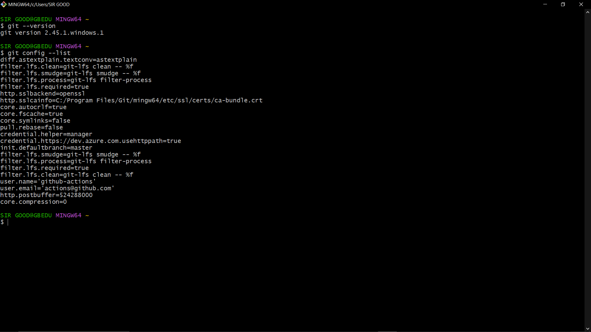
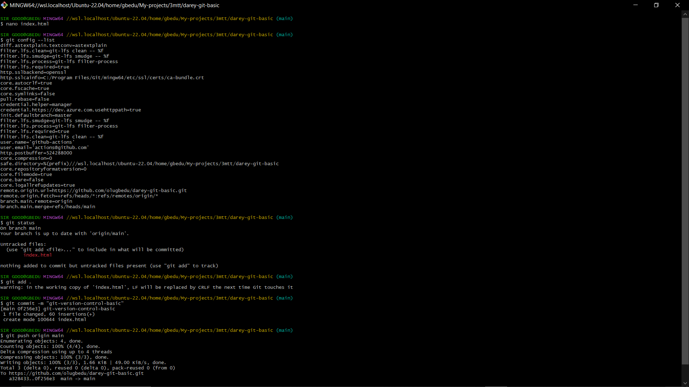
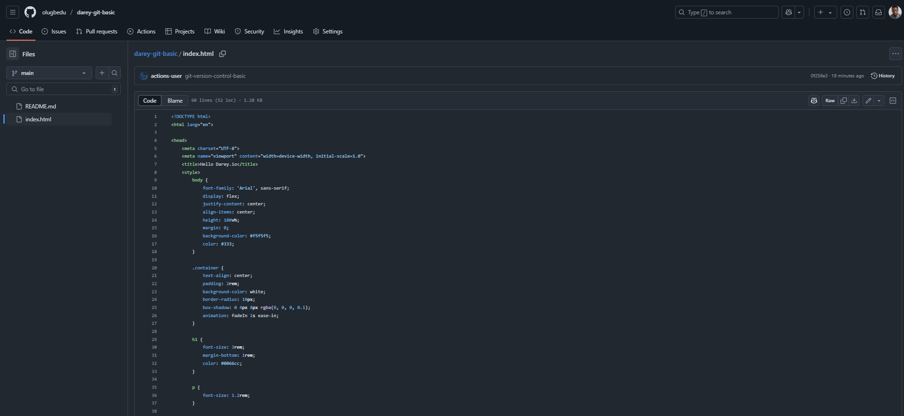

# Git-version-control-basic

## Images of Terminal Execution of Git Commands:

The terminal contains git command executions (git config --list, etc.), validating basic Git usage, also shows a comprehensive flow of commands fulfilling the Instructor's checklist (e.g., adding files, committing, pushing changes).
The required final screenshot displaying detailed collaboration-oriented git commands are attached below.

## GitHub Dashboard Page Images:
There are valid screenshots of the GitHub user dashboard. These fulfill the criteria needed for the GitHub Dashboard and shows collaboration directly tied to the repository specified in the instructions.

## GitHub Repository URL:
The repository screenshot confirms the existence of an index.html file. 
[index.html](https://github.com/olugbedu/darey-git-basic/blob/main/index.html)

